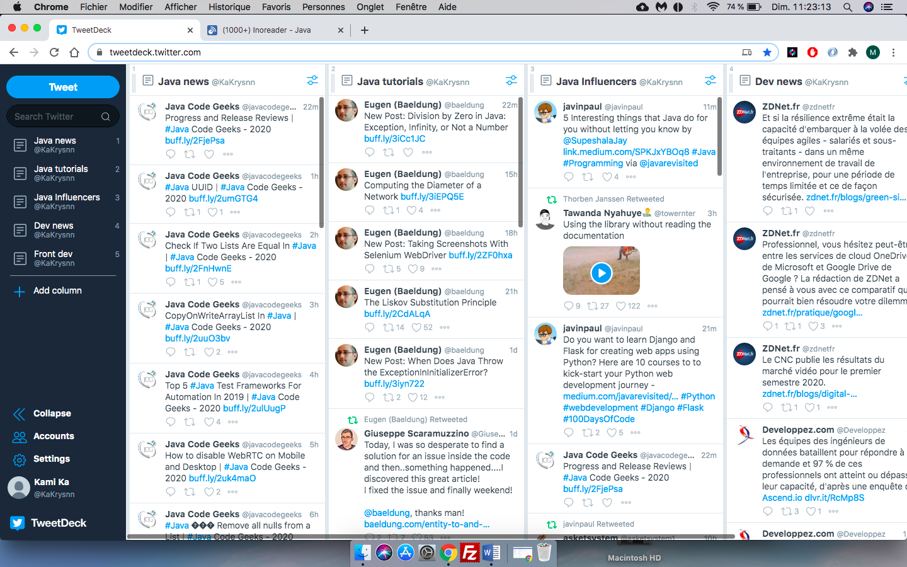
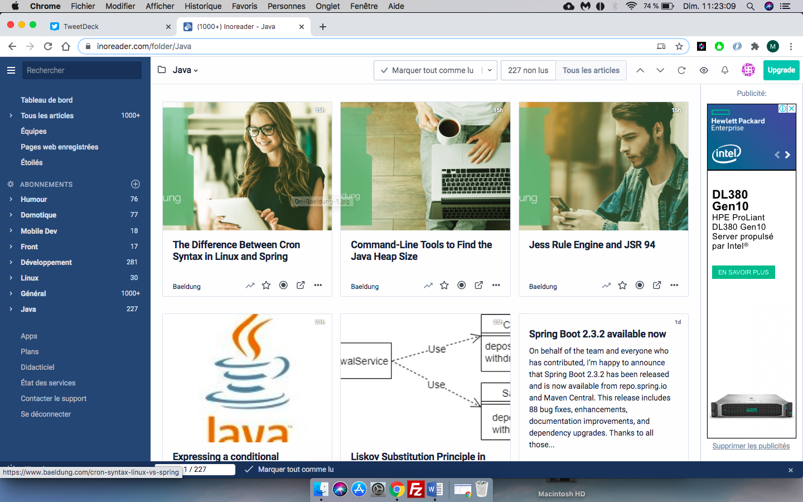

# VEILLE_OC_P11

## Description

Un développeur doit rester constamment à l'affût des nouveautés technologiques, qui évoluent en continu. La veille technologique est pour cela une étape indispensable au quotidien.

La veille technologique est un moment indispensable du quotidien
La veille technologique est un moment indispensable du quotidien
Les bons développeurs suivent régulièrement les nouveautés du secteur (tous les jours et non pas toutes les semaines). Pour rester à jour, vous allez dès maintenant construire votre outil de veille technologique :

1. Liste des technologies/thématiques suivies :
  * Java
  * Spring framework
  * Développement général
  * Développement Frontend : Angular/Javascript/HTML/CSS
 
2. Liste des sites d'actualité pour s'informer sur ces technologies et thématiques :
  * JavaCodeGeeks, Dzone, Oracle, Spring.io, HowtoDoInJava, JavaGuides, Baeldung, JM DOUDOUX, etc.
 
3. Utilisation de Inoreader, tweeter et tweetdeck  sur une page de tableau de bord qui sert d’outil de veille

  * Tweetdeck
  

  * Inoreader
  
